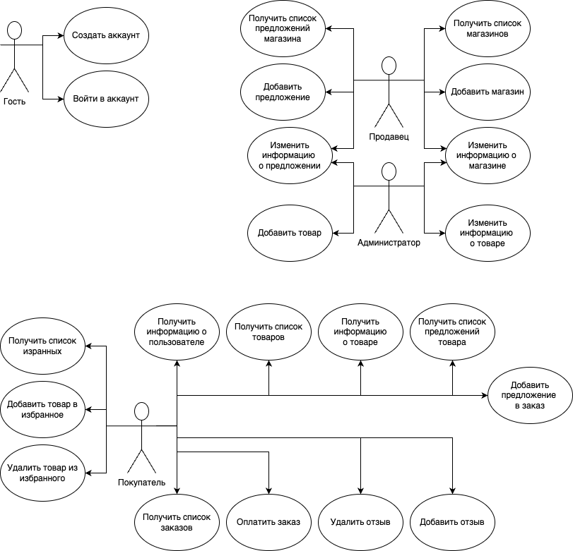
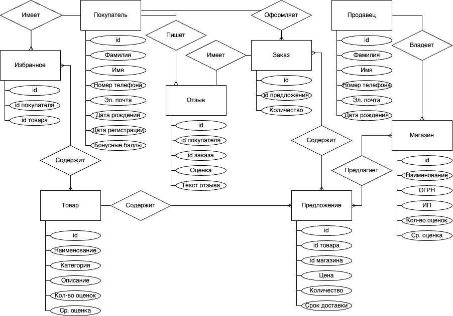
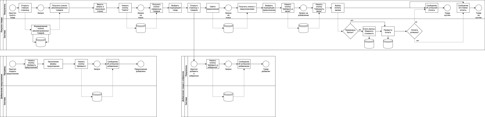
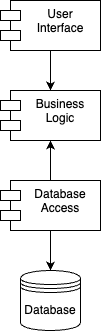
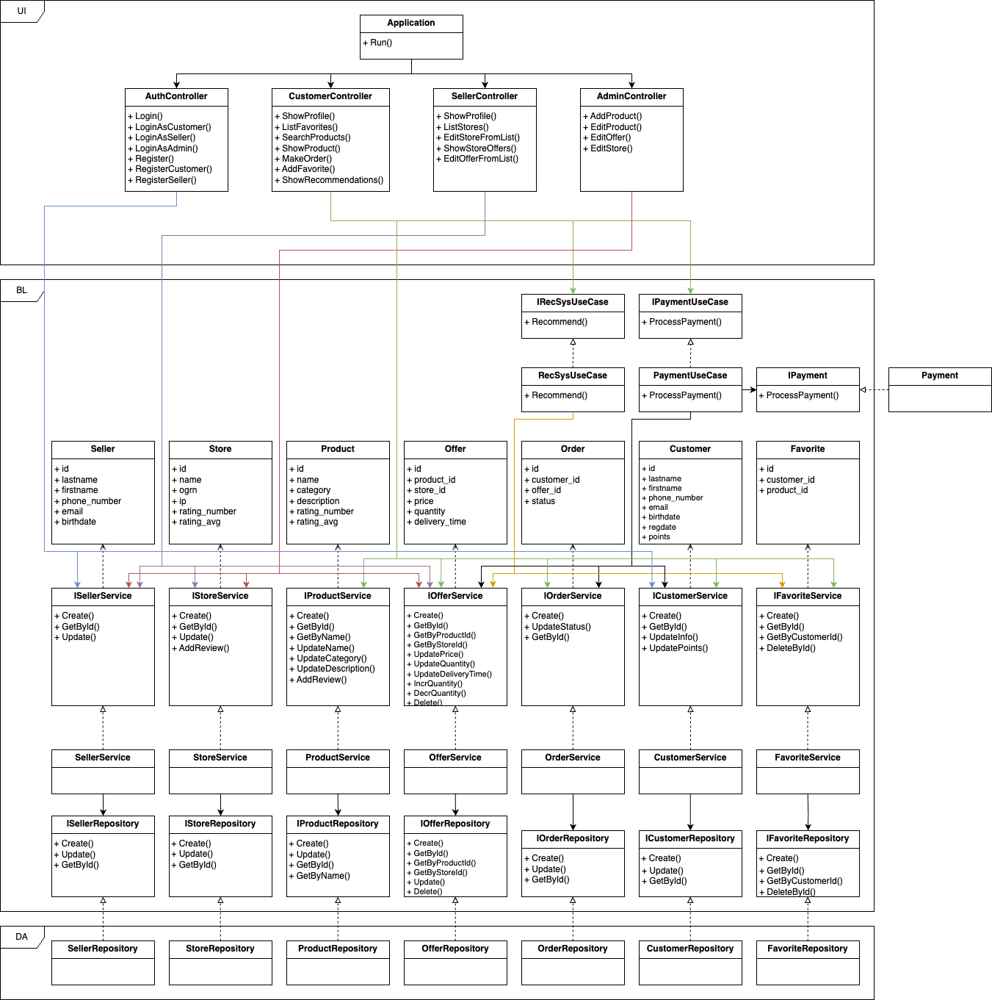
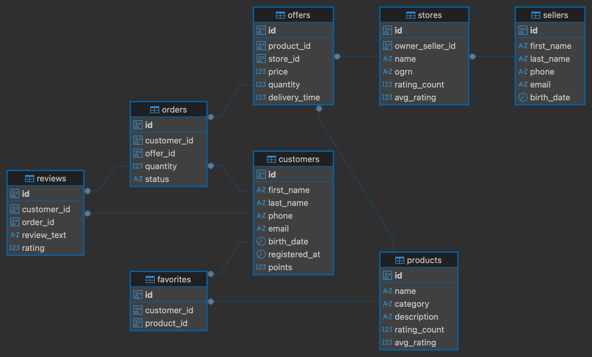
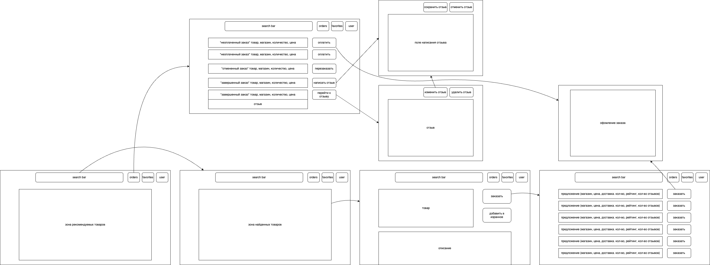

# Название проекта

Маркетплейс

# Краткое описание идеи проекта 
[(1 абзац, 3 предложения)]: #

[Приложение предназначено для размещения товаров для продажи. У каждого товара есть описание и список магазинов, которые продают данный товар. Покупатель может выбрать подходящий товар и подходящий магазин.]: #

Идея проекта заключается в создании платформы, где продавцы смогут предлагать свои товары, а покупатели — находить интересующие их товары с подходящими условиями. Это позволит покупателям быстро находить лучшие предложения, а продавцам продвигать свои товары, находить новых клиентов и увеличивать продажи.

# Краткое описание предметной области 
[(1 абзац)]: #

Маркетплейс предоставляет возможность продавцам и покупателям взаимодействовать друг с другом, совершать сделки по продаже различных товаров и услуг. 

# Краткий анализ аналогичных решений 

[по минимум 3 критериям (1 таблица)]: #

ЯндексМаркет, Ozon, AliExpress, Wildberries, Мегамаркет

# Краткое обоснование целесообразности и актуальности проекта

[1 абзац]: #

(тут можно налить воды о важности и актуальности <имя_темы> в современном мире)

# Краткое описание акторов (ролей)

Гость

Пользователь-покупатель

Пользователь-продавец

Администратор

# Use-Case - диаграмма 
[обратить внимание на UML нотацию, отразить разных акторов пересечение их возможностей в приложении]: #

<!-- 
### Гость:
- Создать аккаунт
- Войти в аккаунт

### Покупатель:
- Получить информацию о пользователе
- Получить список товаров
- Получить информацию о товаре
- Получить список предложений товара
- Добавить предложение в заказ
- Получить список заказов
- Оплатить заказ
- Добавить отзыв
- Удалить отзыв
- Получить список избранных 
- Добавить товар в избранное
- Удалить товар из избранного

### Продавец:
- Получить список магазинов 
- Добавить магазин
- Изменить информацию о магазине
- Получить список предложений магазина 
- Добавить предложение
- Изменить информацию о предложении

### Администратор:
- Изменить информацию о магазине
- Изменить информацию о предложении
- Добавить товар
- Изменить информацию о товаре
-  -->

# ER-диаграмма сущностей 

[не путать с диаграммой БД – диаграмма сущность-связь не приземлена на конкретную СУБД и показывает сущности системы, в том числе те, которые не будут персистентно храниться]: #

# Пользовательские сценарии 

[не менее 3 типовых сценариев, в текстовом виде, расписанных по шагам, для разных акторов]: #

### Создание аккаунта:
1. Пользователь открывает главную страницу приложения;
2. Пользователь нажимает кнопку "Регистрация";
3. Пользователь заполняет форму регистрации;
4. Пользователь нажимает кнопку "Зарегистрироваться".

### Добавление предложения (товара) продавцом:
1. Продавец входит в аккаунт;
2. Продавец нажимает кнопку "Добавить предложение";
3. Продавец заполняет форму предложения (выбирает магазин, выбирает соответствующий товар на маркетплейсе и т.д.);
4. Продавец нажимает кнопку "Добавить";
5. Предложение добавляется в список предложений соответствующего товара.
<!-- 5. Система отправляет предложение на модерацию
1. Администратор утверждает (или отклоняет) предложение;
2. Предложение добавляется в список предложений соответствующего товара. -->

### Покупка товара покупателем:
1. Покупатель открывает главную страницу;
2. Покупатель находит интересующий его товар;
3. Покупатель открывает страницу с информацией о товаре;
4. Покупатель нажимает кнопку "Показать предложения";
5. Покупатель находит интересующее его предложение;
6. Покупатель добавляет подходящее предложение в заказ;
7. Покупатель открывает страницу с информацией о заказе;
8. Покупатель нажимает кнопку "Купить".

# Формализация ключевых бизнес-процессов 

[либо один основной комплексный бизнес процесс, либо 3-4 декомпозированных, небольших, используя BPMN-нотацию]: #

# 1. Описание типа приложения и выбранного технологического стека 
[(Console App/Desktop/Mobile/Web MPA/ Web SPA/Cross-platform и т.д.); ]: #

Тип приложения: Console App (сделано), далее Web SPA. 

Технологический стек: C#, ASP.NET Core, PostgreSQL + Dapper, Vue.

# 2. Верхнеуровневое разбиение на компоненты 
[(в следующих лабах сможете уточнить): на базовом уровне выделяем компонент доступа к данным, компонент бизнес-логики и компонент реализации UI. Отобразить диаграммой компонентов. Подумать про принцип инверсии зависимостей.]: #

# 3. UML диаграмма классов
[( не забыть «модельные» классов сущностей: сущности базы данных, сущности системы и транспортные сущности. Если уровень транспортных сущностей пока сложно спроектировать, можно скопировать системные. Уточните их на следующих этапах)]: #

# Диаграмма БД

# Пользовательский интерфейс 

